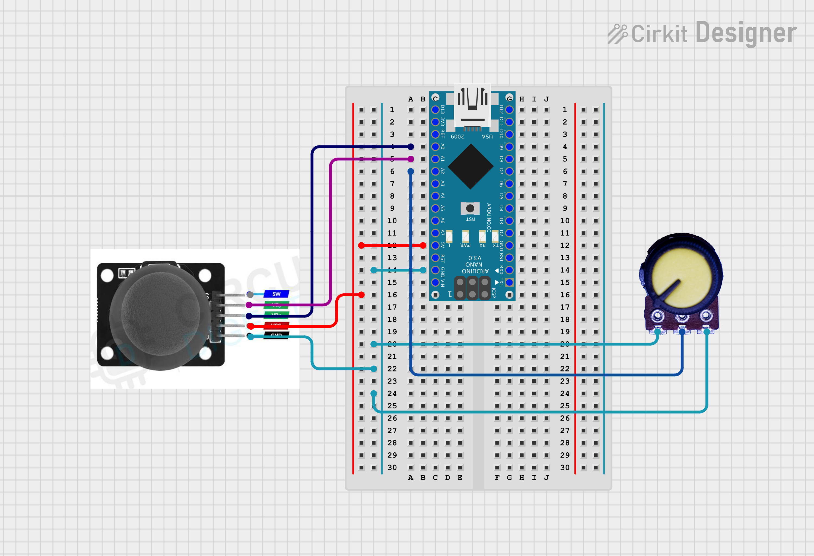
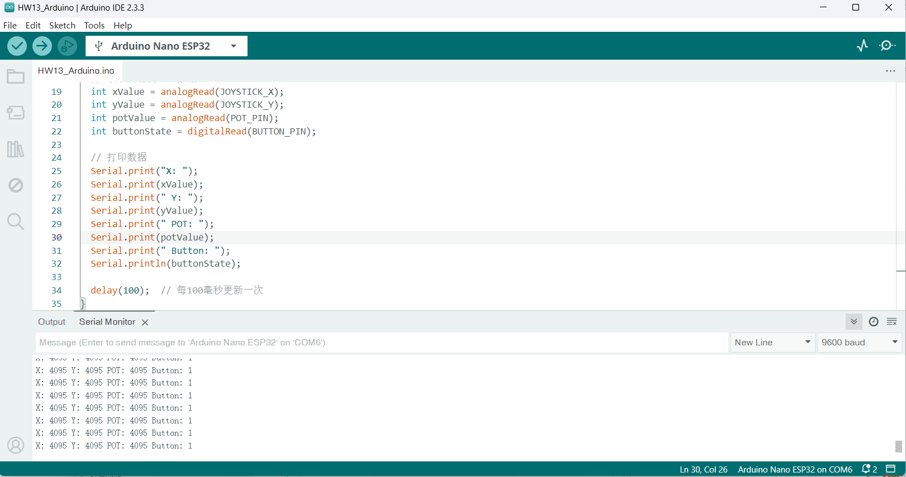

# HW13
## Description
This is an interactive pattern generator based on Arduino and p5.js. The position of pattern generation is controlled by a joystick, and the potentiometer adjusts the characteristics of the shape, realizing real-time visual art creation. The system automatically and continuously generates patterns.

## Features
- Automatic continuous pattern generation
- Random color and transparency
- Adjustable shape parameters
- Smooth position control
- Real-time interactive feedback

## Instructions
1. Click the "Connect Serial Port" button
2. Select the correct serial port
3. Move the joystick to control position
4. Rotate the potentiometer to change shape characteristics

## Circuit
[Circuit](https://app.cirkitdesigner.com/project/b5e33416-c1f4-4e88-a9aa-e550f7a888c2)


### Joystick Connection
- VRx → A0 (X-axis)
- VRy → A1 (Y-axis)
- VCC → 5V
- GND → GND

### Potentiometer Connection
- Signal Pin → A2
- VCC → 5V
- GND → GND

## Hardware Testing Process
To ensure the hardware works properly, I first conducted a simple test in Arduino:


```
// Test code
void setup() {
  Serial.begin(9600);
  pinMode(JOYSTICK_X, INPUT);
  pinMode(JOYSTICK_Y, INPUT);
  pinMode(POT_PIN, INPUT);
  
  Serial.println("Hardware test started");
}

void loop() {
  // Read and print all sensor data
  int xValue = analogRead(JOYSTICK_X);
  int yValue = analogRead(JOYSTICK_Y);
  int potValue = analogRead(POT_PIN);
  
  Serial.print("X: ");
  Serial.print(xValue);
  Serial.print(" Y: ");
  Serial.print(yValue);
  Serial.print(" POT: ");
  Serial.println(potValue);
  
  delay(100);  // Update every 100ms
}
```

Through this test program, I observed:
1. The joystick's center position value is approximately 3150
2. The complete input range is 0-4095
3. The potentiometer can smoothly vary across the entire range
4. All sensors respond stably

These observations helped me determine the mapping ranges in the code and verify the reliability of the hardware connections.

### Problems I Met
- The joystick's center position value of approximately 3150 caused the pattern generation position to be offset to the lower right of the screen

- To solve this issue, I split the mapping range into two segments:
0-3150 maps to the first half of the screen; 3150-4095 maps to the second half of the screen.
```
let x;
if (joystick.x <= 3150) {
  x = map(joystick.x, 0, 3150, 0, width/2);
} else {
  x = map(joystick.x, 3150, 4095, width/2, width);
}
```

**This adjustment ensures that**:
- When the joystick is in the center position, the shape appears in the center of the screen
- The entire screen space is effectively utilized


